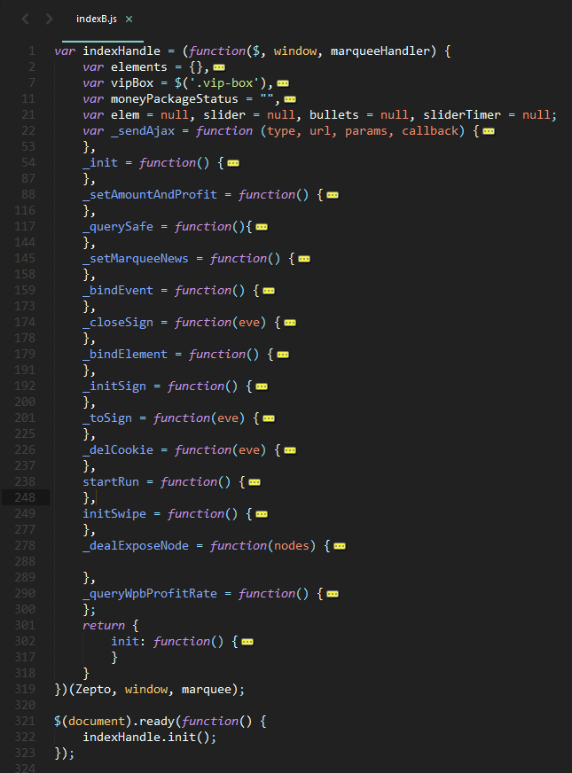

# npm shrinkwrap
`npm-shrinkwrap`可以按照当前项目`node-modules`目录内的安装包情况生成稳定的版本号描述

> `shrinkwrap` 命令根据目前安装在`node_modules`的文件情况锁定依赖版本。在项目中执行 `npm install`
 的时候，`npm` 会检查在根目录下有没有 `npm-shrinkwrap.json` 文件，如果` shrinkwrap `文件存在的话，`npm` 会使用它（而**不是** package.json）来确定安装的各个包的版本号信息。
这样一来，在安装时候确定的所有版本信息会稳定的固化在 `shrinkwrap` 里。无论是A，B 和 C中的版本如何变化，或者它们的 `package.json `文件如何修改，你始终能保证，在你项目中执行` npm install` 的到的版本号时稳定的。

# 前端模块化编程的概念
https://github.com/fouber/blog/issues/4
前端模块化框架的使命:`模块管理`，`资源加载`。

`合并请求`和`按需加载`都有实现上的矛盾
- 要么放弃按需加载，把所有的js合成为一个文件，从而满足请求合并
- 放弃请求合并，请求独立的模块从而实现按需加载

`依赖管理`

> 以纯前端方式实现模块化框架 不能 同时满足 按需加载，请求合并 和 依赖管理 三个需求。
> 纯前端方式只能在运行时分析依赖关系。

> 由于根本问题出在 运行时分析依赖，因此新思路的策略很简单：不在运行时分析依赖。这就要借助 构建工具 做线下分析了，其基本原理就是：

利用构建工具在线下进行 模块依赖分析，然后把依赖关系数据写入到构建结果中，并调用模块化框架的 依赖关系声明接口 ，实现模块管理、请求合并以及按需加载等功能。

模块化编程最引人注意的就是javascript的模块化编程。
- 函数封装
- 对象
- 立即执行函数
## 在mjr项目中的模块化

这个就是简单的立即执行函数来达到隐藏细节的目的。可以看以上代码
依赖关系
```
<script type="text/javascript" src="./xxx.js"></script>
```

## 在运营管理后台中的模块化
[前端模块化](http://www.w3cfuns.com/notes/20963/fc5ee24d4c0cff32334846bdd0c74c42.html)
这样在模块外部无法修改我们没有暴露出来的变量函数，就是模块化的基础。
JavaScript模块化的规范也有两种CommonJS和AMD。

## CommonJS规范
> 一个单独的文件就是一个模块，每个模块都是一个单独的作用域，模块内部定义的变量其他模块无法读取，除非定义为global对象的属性。
> 模块输出，一个模块只有一个出口，module.exports对象，将模块需要输出的内容放入该对象即可
> 加载模块，使用require方法即可，方法会读取文件并执行，返回文件内部的module.exports对象

require是个同步操作，模块系统需要同步读取模块文件内容，并编译执行以得到模块接口。在服务器端实现方便，但在浏览器端则无法正常加载。

## AMD
异步模块定义，是浏览器端模块化开发的规范，Javascript不支持原生支持。在使用AMD
规范对页面进行开发是需要使用对应的库函数，大名鼎鼎的就是RequireJS。

## Browserify

Commonjs风格的模块及依赖管理
参照Node中的模块系统，约定用`require()`来引用其他模块，用`module.exports`
仅仅处理javascript脚本
## 面向未来的模块管理机制 ES6模块化

[使用 gulp 搭建前端环境之 CommonJs & ES6 模块化(中级篇)](https://segmentfault.com/a/1190000004141674)

没有着力于提供一个“运行时”的模块加载器，而是强调预编译。
# webpack从入门到入门
> webpack is a module bundler. webpack takes modules with dependencies and generates static assets representing those modules

---
> webpack是一个模块打包工具，输入为包含依赖关系的模块集，输出为打包合并的前端静态资源

webpack 可以将任何前端资源视为模块，如css,图片，文本。
webpack本身只会处理javascript
而对于其他类型的资源是通过不同的loader将对应的资源转化为javascript模块

Webpack的工作方式是：把你的项目当做一个整体，通过一个给定的主文件（如：index.js），Webpack将从这个文件开始找到你的项目的所有依赖文件，使用loaders处理它们，最后打包为一个浏览器可识别的JavaScript文件。

## 优点

## 环境搭建
首先需要一个Nodejs的环境，需要通过npm包管理工具下载webpack的命令，在全局中安装该命令。
```
npm install webpack -g
```
如图建立目录结构


命令行的形式调用，在改菜单目录下执行
```
webpack src/index.js dist/index.js
```
在`dist/index.js`中可以查看到编译的结果

每次都输入命令行去编译的话需要输入很长的参数，所以webpack提供了通过配置的方式去执行任务，在项目的目录下创建webpack.config.js即可。
Webpack拥有很多其它的比较高级的功能（比如说本文后面会介绍的loaders和plugins），这些功能其实都可以通过命令行模式实现，但是正如已经提到的，这样不太方便且容易出错的，一个更好的办法是定义一个配置文件，这个配置文件其实也是一个简单的JavaScript模块，可以把所有的与构建相关的信息放在里面。

文／zhangwang（简书作者）
原文链接：http://www.jianshu.com/p/42e11515c10f
著作权归作者所有，转载请联系作者获得授权，并标注“简书作者”。
在配置文件中进行配置
其中参数的含义如下所示
简单的进行输入和输出的操作。webpack检测配置文件，读取模块入口与输出路径和文件名,将文件依赖整合成一个文件。
```
{
    entry: [String | Array | Object], // 入口模块
    output: {
        path: String,      // 输出路径
        filename: String   // 输出名称或名称 pattern
        publicPath: String // 指定静态资源的位置
        ...                // 其他配置
    }
}
```
然后执行npm init操作，在该目录下安装webpack的依赖。
### 加载其他类型的文件
我们知道在前端文件的编写过程中存在许多类型的文件，至少会有图片和样式文件等等
简单的SPA程序加载，包括：JS编译与加载、CSS编译与加载、图片加载与压缩、JS与CSS压缩。

Webpack提供了一套加载器机制，比如：css-loader、style-loader、url-loader等，用于将不同资源加载到js文件中，例如url-loader用于在js中加载png/jpg格式的图片文件，css/style loader 用于加载css文件，less-loader用于将less文件编译成css。
## loaders的介绍
loader可以通过类似管道的方式连接起来，管道的执行方向为从右向左

常用的加载器包括css-loader style-loader url-loader。这些加载器的作用就将不同的文件加载到js文件中。同样这些加载器也是用Nodejs进行编写的，在项目中使用的时候就需要添加到依赖。
```
cnpm install style-loader css-loader url-loader less-loader
```
在入口文件中添加如下代码，就可以看到
```
require('style!css!./index.css')
```

刚刚介绍了行内加载资源的方式，如果有很多css或者图片资源需要加载，重复写加载器显得很笨拙，webpack提供另一种方式加载资源。在配置文件添加配置：loaders也可以使用配置的方式，简化我们的工程，达到统一管理的目的。
```
 module: {
       loaders: [
           // => .css 文件应用  "style" 和 "css" loader
           { test: /\.css$/, loader: "style!css" },
           // => .less 文件应用  "style" 和 "css" loader
           { test: /\.less$/, loader: "style!css!less" },
           // => url-loader 配置  mimetype=image/png 参数
          //  {
          //      test: /\.png$/,
          //      loader: "url-loader?mimetype=image/png"
          //  },
       ]
   }
```
### webpack的一些使用的指令
```
$ webpack --config XXX.js   //使用另一份配置文件（比如webpack.config2.js）来打包

$ webpack --watch   //监听变动并自动打包

$ webpack -p    //压缩混淆脚本，这个非常非常重要！

$ webpack -d    //生成map映射文件，告知哪些模块被最终打包到哪里了
```
entry: 定义整个编译过程的起点

output: 定义整个编译过程的终点

module: 定义模块module的处理方式

plugin 对编译完成后的内容进行二度加工

resolve.alias 定义模块的别名

## 独立打包样式文件
> 话说天下大势，分久必合，合久必分。

前端工程一项就是减少http请求，这表示需要把多个js合并成一个，但是，单个js文件过大会影响浏览器加载文件速度，由于现在浏览器并发http请求多达6个，可以利用这个特性，将可复用第三方资源库分离加载。

有时候需要=考虑到类库代码的缓存，可以考虑打包的时候打成多个包
将多个页面的公用模块独立打包，从而可以利用浏览器缓存机制来提高页面加载效率；


- ExtractTextPlugin


## 插件的介绍
webpack提供插件机制，可以对每次的build结果进行助理，配置plugin参数就可以。
是用来扩展Webpack功能的，会在整个构建过程中生效，执行相关任务。
loaders和plugins容易混淆，但它们其实是不同的东西
loaders是在打包过程中用来处理源文件的，
plugins不直接操作单个文件，它对整个构建过程起作用。

- HTMLWebpackPlugin
根据一个简单的模板，帮你生成最后 的html文件，html文件里自动引用你打包后的js文件，每次编译都可以在文件名中插入一个不同散列值。

- Hot Module Replacement 
HMR是webpack中的一个非常实用的插件，允许你在修改组件代码后，自动刷新、实时预览修改后的效果。

在webpack配置文件中添加HMR插件；
在Webpack Dev Server中添加“hot”参数；

### 分割vendor代码和应用业务代码

### webpack-dev-server
https://segmentfault.com/a/1190000002985564
webpack提供的基于node.js的Express服务器
它提供如下的服务
- server服务
- 监控源文件的修改，如果源文件改变了，就会调用webpack重新打包
这样就避免了重复输入webpack的方法了。

##  参考资料

https://segmentfault.com/a/1190000003985797
